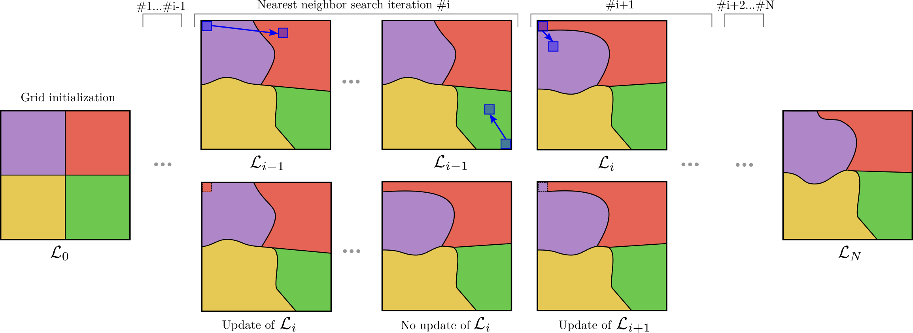

## Texture Superpixel Clustering from Patch-based Nearest Neighbor Matching (NNSC)

### Overview

Implementation of paper:  [PDF](https://arxiv.org/abs/2003.04414)
```
@inproceedings{giraud2019nnsc,
  title={Texture Superpixel Clustering from Patch-based Nearest Neighbor Matching},
  author={Giraud, R{\'e}mi and Berthoumieu Yannick},
  conference={European Signal Processing Conference (EUSIPCO 2019)},
  year={2019}
}
```

- NNSC superpixels generated using texture-aware patch-based distances within a nearest neighbor matching framework (PatchMatch) 




### Requirements

- Linux

- For C++ version:  [CImg library](http://cimg.eu/)  (unique .h already included)


### Execution

#### MATLAB / C-Mex
```
run main.m    %call NNSC_mex
```


#### C++

- Compilation:
```
make
```

- Execution prototype:
```
./NNSC -i img_name [-k superpixel_nbr(450)] [-m compactness(0.075)]  [-outm output_map_name(./res/labelmap.png)] [-outb output_border_name(./res/borders.png)]
```
- Execution with contour map:  (make test)
``` 
./NNSC -i ./data/test_img.jpg -k 350 -m 0.075 -outm test_img_labelmap.png -outb test_img_border.png
```
- Execution on an image list:  (make test_list)
```
./scripts/test_list.sh ./data/list_file.txt ./data/ 350 0.075
```


### Data

The Berkeley Segmentation Dataset (BSD): containing 500 images of size 321x481 pixels with segmentation and contour ground truths is available 
[here](https://www2.eecs.berkeley.edu/Research/Projects/CS/vision/grouping/resources.html)

CTD: Composite texture dataset: mix-Brodatz: Natural composite texture dataset using images from the Brodatz dataset image
mix-Stripes: Synthetic composite texture dataset combining lines with different orientations
[here](https://github.com/rgiraud/ctd)


### License

(C) Rémi Giraud, 2019
remi.giraud@u-bordeaux.fr  
[https://remi-giraud.enseirb-matmeca.fr](https://remi-giraud.enseirb-matmeca.fr)  
ENSEIRB-MATMECA (Bordeaux INP), Laboratory IMS

This code is free to use, share and modify for any non-commercial purposes.
Any commercial use is strictly prohibited without the authors' consent, also including authors from (chen2017) since SCALP uses some part of their code:
```
@InProceedings{chen2017,
    author   = {Jiansheng Chen and Zhengqin Li and Bo Huang},
    title    = {Linear Spectral Clustering Superpixel},
    booktitle  = {IEEE Transactions on Image Processing},
    YEAR   = {2017},
}
```


This code is free to use for any non-commercial purposes.
It contains an implementation of the TASP superpixel method proposed in:
[1] - 
      Rémi Giraud, Yannick Berthoumieu
      

Note that the core of the implementation is based on the provided code associated to the following paper:
[2] - Zhengqin Li, Jiansheng Chen
      Superpixel Segmentation using Linear Spectral Clustering
      International Conference on Computer Vision and Pattern Recognition (CVPR), 2015

If you use this code, please cite both [1] and [2].

(C) Rémi Giraud, 2019
rgiraud@u-bordeaux.fr, https://remi-giraud.enseirb-matmeca.fr
Bordeaux-INP, IMS Laboratory


%%%%%%% MATLAB - C++/MEX %%%%%%%%%

run main.m


%%%%%%% C++ %%%%%%%%%

////// COMPILATION /////

- Need CImg library :  http://cimg.eu/

- To compile : make


////// EXECUTION //////

./NNSC -i img_name [-outm output_map_name] [-outb output_border_name] [-k superpixel_nbr] [-m compactness] [-Kpm knn_by_PM] [-patch_w patch_size] 

Example with contour map:  (make test)
./NNSC -i test_img.jpg -k 300 -m 0.1 -outm test_img_map.png -outb test_img_border.png

On an image list:  (make test_list)
./scripts/test_list.sh ./data/list_file.txt ./data/ 450 0.1


